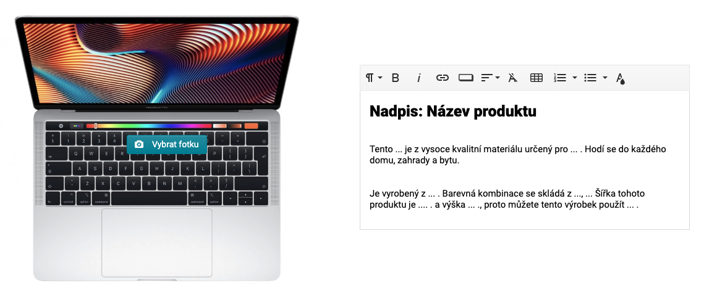
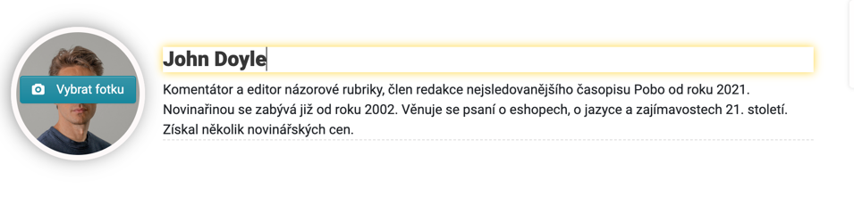
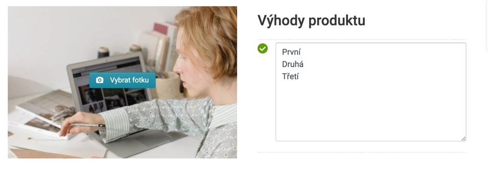
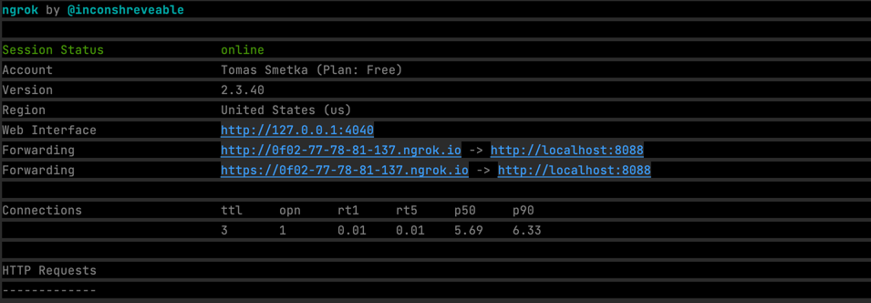
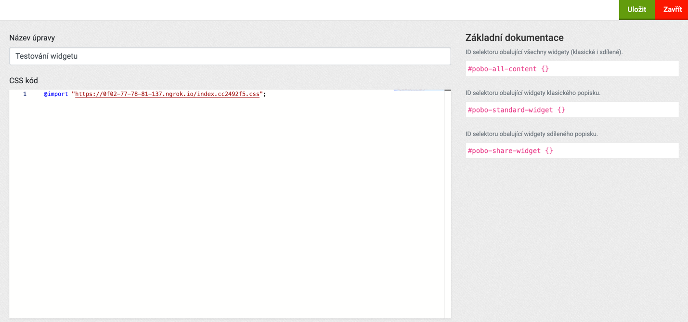
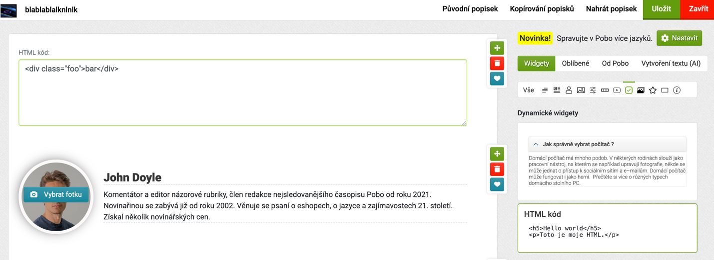

# Generické šablony (POC)

Tento repozitář obsahuje generické šablony pro widgety v Pobo Page Builder.

Changelog verze:

- [2.0.3](version/2.0.3.md) - Add variables for list item, paragraph, title line, standard table
- [2.0.2](version/2.0.2.md) - Add background color variable 
- [2.0.1](version/2.0.1.md) - Add mobile variable support
- [2.0.0](version/2.0.0.md) - First version

# Vytváření widgetu v Pobo Page Builder

Tento repozitář slouží především pro klienty doplňku Pobo Page Builder, kteří si
chtějí upravovat vzhled svých widgetů. 

## Než začneme...

Ještě předtím než začneme je potřeba mít na svém počítači nainstalované tyto nástroje:  

1. Verzovací systém [git](https://git-scm.com/)
2. [nodejs](https://nodejs.org/en/) (min. >=10.19)
3. [npm](https://www.npmjs.com/) (min. >=6) nebo [Yarn](https://yarnpkg.com/)

## Stažení repozitáře

1. Stáhněte si tento repozitář příkazem: 

```
git clone git@github.com:pobo-builder/widget-asset.git
```

Následně nainstalujeme závislosti příkazem: 
```
npm install
```
Pokud používáte yarn:
```
yarn install
```

# Adresářová struktura

Po instalaci závislostí v adresáři uvidíme následující strukturu:

``` 
├── README.md
├── dist
├── node_modules
├── package-lock.json
├── package.json
└── src
    └── *.scss
```

Nás zajímají hlavně:  

1. Adresář `dist/*` obsahuje JS a CSS, které se kompilují z adresáře `src/*`
2. V adresáři `src/*` se nacházejí zdrojové SCSS soubory jednotlivých Pobo widgetů
3. V Souboru `package.json`, v sekci `scripts` se nacházejí následující příkazy, které můžeme použít:
   1. `watch` (spouštíme příkazem `npm run watch`) sleduje veškeré soubory v adresáři `src/*` a při jejich změně k dojde ke kompilaci do `dist/*`
   2. `build` (příkaz `npm run build`) provede kompilaci souborů `src/*` do `dist/*`, odstraní sourcemaps a zminifikuje kód
   3. `proxy` (`npm run proxy`) vytvoří tunel (proxy) z `localhost:8088` na veřejnou URL (vysvětleno dále) 


## Píšeme první widget

Nyní začneme s kódováním našeho prvního widgetu. Nejdříve si vytvoříme nový PR 
`git checkout -b "widget-fv-bikemax-benefix-big" origin/main`. 

Dále si si vytvoříme SCSS soubor v adresáři `src/*` který 
pojmenujeme podle konvence `.[brand]-[client]-[typ-widgetu]-[varianta]` (např. `fv-bikemax-benefit-big.scss`). Tento 
SCSS soubor naimportujeme do `src/editor.scss` (např. `@import "fv-bikemax-benefit-big.scss";`).

Následně spustíme příkaz `npm run watch` který se postará o sledování změn v SCSS souborech + kompilaci do CSS a
vytvoří server s nastylovanými widgety na url http://localhost:8088. 

## Píšeme CSS (SCSS)

Widgety doporučujeme stylovat metodikou [BEM](https://www.vzhurudolu.cz/prirucka/bem), která zaručí nízkou specifičnost
a minimální riziko ovlivnění externími úpravami (např. přetížení stylů šablonou, globálními úpravami kodérů a pod.).

Při psaní tříd **doporučujeme** používat prefixy podle názvu SCSS souboru (např. `.fv-bikemax-benefit-big {}`. Tím se vyhneme 
kolizím s jinými widgety. Kód tedy bude vypadat přibližně takto:

```scss

.fv-bikemax-benefit-big {
  &__title {
    font-size: 10px
  }
  
  &__subtitle {
    font-size: 20px;
  }

  &__image {
    float: left;
  }
}
```

**Důležitá informace:** V prefixech nepoužívejte `.pb-*` ani `.rc-*` - tyto prefixy používá Pobo Page Builder pro 
widgety dostupné všem klientům a mohlo by dojít ke kolizi. 

## Vyjímky při stylování obsahu

V Pobo Page Builder lze pro úpravu textu použít dva způsoby:

1. Vytváření  obsahu ve wysiwyg editoru (s možností vkládat nadpisy, odstavce, odkazy, tabulky atd.). Nejčastěji se 
používá pro obsah, ve kterém chce klient pracovat s plnohodnotným obsahem a je prostor pro zobrazení  wysiwyg editoru. 
Obsah v něm nelze stylovat BEM metodikou, ale je potřeba jej nastylovat zanořením. 



Ukázkové SCSS:

```scss
.fv-bikemax-benefit-big {
  &__image-container {
    position: relative;
  }
  
  &__image {
    float: left;
  }
  
  &__content {
    h2 {
        font-size: 20px;
    }

    p {
      font-size: 10px;  
    }
    
    a {
      text-decoration: underline;
    }
    
    ul, li, table .. atd {
      ....
    }
  }
}
```

HTML bude vypadat následovně: 

```html
<div class="fv-bikemax-benefit-big">
  <div class="fv-bikemax-benefit-big__image-container">
    
  </div>
  <div class="fv-bikemax-benefit-big">
    ↓ ------------------------------------------------|
    <h2>Hello world</h2>                              |  Obsah zabalený ve wysiwyg 
    <p>Lorem ipsum is <a href="#">dolores</a>.</p>    |        
    ↑ ------------------------------------------------|
  </div>
</div>
```

2. Text v jednoduchí podobě 

Jednoduchý text (bez moožnosti vkládání odkazu, tabulek a pod.) se styluje klasicky podle BEM metodiky. Kód bude bude 
vypadat např.:

```scss
.fv-bikemax-benefit-big {
  &__image {
    float: left;
    position: relative;
  }
  
  &__title {
    font-size: 20px;
  }
  
  &__subtitle {
    font-size: 10px;
  }
}
```

HTML bude vypadat následovně:

```html
<div class="fv-bikemax-benefit-big">
  <div class="fv-bikemax-benefit-big__image-container">
    
  </div>
  <div>
    <h2 class="fv-bikemax-benefit-big__title">Hello world</h2> ←------------------| Nadpis může být  `<h2>`, `<h3>`
    <span class="fv-bikemax-benefit-big__subtitle">Lorem ipsum is samet</span> ←--| Pro jednoduchý text použiejem `<span>`
  </div>
</div>
```



## Stylování obrázků

Obrázky obalujeme elementem, který má nastavenou CSS vlastnost `position: relative`. Pobo vkládá k obrázku tlačítko, 
které je absolutně napozicované vůči rodiči (viz. ukázka kódu výše).

## Používání odrážek a seznamů

Odrážky a číslované seznamy se v Pobo používají tak, že místo `<li>` zobrazí pole (textarea) pro vkládání textu:



Pobo následně vytvoří z každého nového řádku položku v seznamu (li). Z  tohoto důvodu doporučujeme používat
seznamy na jednoduché texty (do `<li>` nelze vkládat span a pod.). 

# Psaní HTML 

HTML widgetu píšeme do souboru `widget.html` vždy na konec seznamu widgetů. Parcel v případě změny v `index.html`
provede hotreload a změny se projeví ihned (i v CSS).


## Testování widgetu před nasazení ke klientovi 

Před nasazením je dobré otestovat zobrazení widgetu na straně klienta a jeho e-shopu. K tomu slouží
jednoduchý postup:

1. Spustíme ngrok (proxy server na lokální vývoj) příkazem `npm run proxy`
3. Terminál nám vrátí následující výstup: 



Nás zajímá veřejné URL, kterou nám vrátí, např. `https://abcd-12-34-56-789.ngrok.io/`. Tato URL je public tunelem (proxy)
na náš lokální server (`http://localhost:8088/`). 

3. Otevřeme si `https://abcd-12-34-56-789.ngrok.io/` a vyhledáme si CSS soubor, který je nalinkovaný v hlavičce
(např. `/index.cc2492f5.css` (název bude vždy jiný, používá se content hash)). Zkopírujeme si cestu k CSS souboru 
(např. `https://abcd-12-34-56-789.ngrok.io/index.cc2492f5.css`).

4. Poté se přihlásíme do Pobo na url  [www.pobo.cz/login](https://www.pobo.cz/login), přejdeme na stránku
   [www.pobo.cz/app/asset](https://www.pobo.cz/app/asset), vytvoříme první úpravu a do pole kód vložíme následující: 

```scss
@import "https://abcd-12-34-56-789.ngrok.io/index.cc2492f5.css";
```



Následně uložíme. Tímto krokem přiložíme testovací CSS k widgetu. 

6. Nyní si vyhledáme produkt, na kterém
otestujeme widget. V editoru si vyhledáme pomocí filtrů v pravém panelu  **Widget s HTML kódem**, vložíme do obsahu a pastneme 
něj HTML widgetu:



Následně provedeme export produktu a zkontrolujeme vzhled widgetu na produktu. V této fázi můžeme upravovat SASS a provést
korekci vzhledu bez nutnosti kamokoliv ukládat CSS. 

7. Jakmile bude widget dokončený, vytvoříme PR a pošleme info na `tomas@pobo.cz` s odkazem na PR. Nezapomene také
smazat vytvořenou vlastní úpravu v Pobo.

Na nasazení widgetu do produkce se widget objeví v záložce `Od Pobo`.


## Děkujeme partnerům


